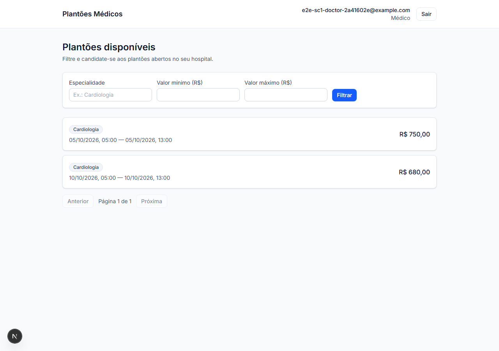
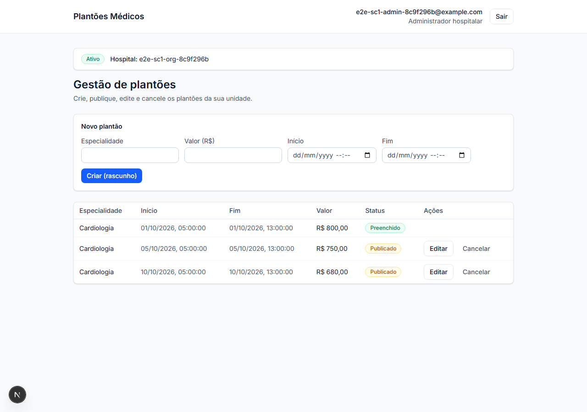
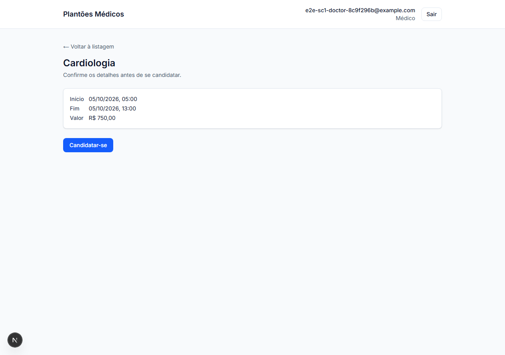
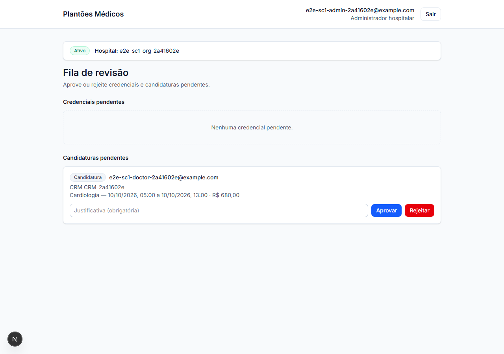
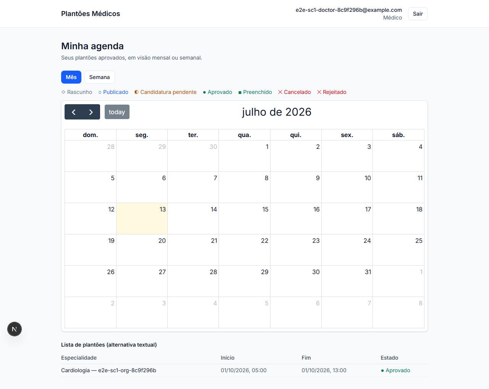
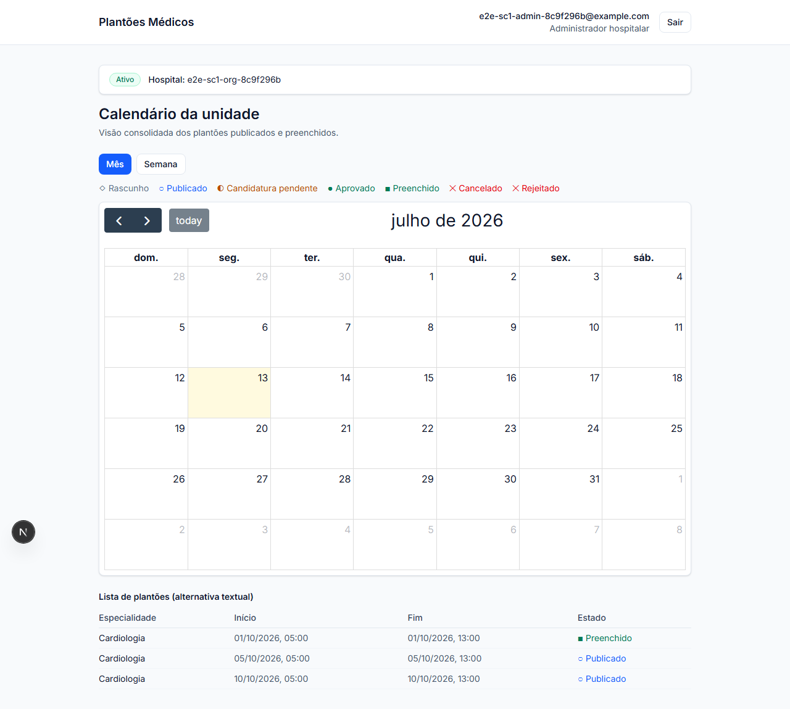

# Plantões Médicos

SaaS multi-tenant de gestão de plantões médicos: hospitais publicam vagas, médicos se candidatam, admins credenciam e aprovam — com isolamento de dados garantido no nível do banco, não só na camada de aplicação.

> Projeto pessoal de estudo/portfólio, construído do zero (schema, API, frontend, testes, observabilidade e deploy).

## Índice

- [Visão geral](#visão-geral)
- [Screenshots](#screenshots)
- [Arquitetura](#arquitetura)
- [Stack](#stack)
- [Como rodar localmente](#como-rodar-localmente)
- [Testes](#testes)
- [Estrutura do monorepo](#estrutura-do-monorepo)
- [Decisões técnicas que valem destaque](#decisões-técnicas-que-valem-destaque)
- [Roadmap](#roadmap)

## Visão geral

Três perfis de usuário, cada um com um fluxo completo:

| Perfil | O que faz |
|---|---|
| **Hospital** (`HOSPITAL_ADMIN`) | Publica, edita e cancela plantões. Revisa e aprova/rejeita candidaturas de médicos e credenciais (CRM). Mantém o perfil público do hospital (cidade, descrição). |
| **Médico** (`DOCTOR`) | Busca plantões por cidade/especialidade/valor, se candidata, acompanha em calendário visual, recebe notificações. |
| **Superadmin** | Enxerga todos os hospitais em modo leitura (auditado), sem poder de escrita sobre dados de terceiros. |

## Screenshots

| Portal do médico | Portal do hospital |
|---|---|
|  |  |
|  |  |
|  |  |

## Arquitetura

```
┌─────────────┐        ┌──────────────────┐        ┌─────────────┐
│   Next.js   │  HTTP  │      NestJS       │  SQL   │  PostgreSQL │
│   (apps/    │◄──────►│     (apps/api)    │◄──────►│  + RLS por  │
│    web)     │        │                   │        │   tenant    │
└─────────────┘        └─────────┬─────────┘        └─────────────┘
                                  │ outbox
                                  ▼
                         ┌─────────────────┐
                         │  Worker (BullMQ  │
                         │   + Redis)       │───► Email transacional
                         │  notificações    │
                         └─────────────────┘
```

- **Multi-tenancy real**: cada hospital é uma `Organization`; isolamento reforçado por Row-Level Security no Postgres (`apps/api/src/organizations/tenant-context.ts`), não apenas por `WHERE organizationId = ?` na aplicação — um bug de query não vaza dados de outro tenant.
- **Outbox transacional**: eventos de domínio (candidatura aprovada, credencial revisada) são gravados na mesma transação que a mudança de estado, depois publicados por um worker assíncrono — sem perda de notificação em caso de falha entre "salvar" e "notificar".
- **Observabilidade**: OpenTelemetry (traces + métricas) instrumentado desde o início, não como afterthought.
- **Autenticação**: OIDC real via `jose`, com um provider fake local (`ALLOW_FAKE_OIDC`) só para dev/demo — nunca ativável em produção por design (`fail closed` se `OIDC_ISSUER_URL` estiver vazio e a flag não for setada).

## Stack

**Backend** — NestJS · Prisma · PostgreSQL (RLS) · Redis + BullMQ · OpenTelemetry · Vitest
**Frontend** — Next.js (App Router) · React · FullCalendar · Playwright (E2E)
**Infra** — Docker Compose · pnpm workspaces (monorepo)

## Como rodar localmente

```bash
# 1. Variáveis de ambiente
cp infra/.env.example infra/.env   # preencher os valores — nunca commitar infra/.env

# 2. Subir tudo (Postgres, Redis, migrations, API, worker, web)
docker compose -f infra/docker-compose.yml --env-file infra/.env up -d

# App em http://localhost:3000, API em http://localhost:3001
```

`docker compose up` sozinho já aplica as migrations e sobe a role de runtime restrita (`plantoes_app`, sujeita a RLS) antes de subir API/worker — nenhum passo manual extra numa máquina limpa.

Para desenvolvimento sem Docker (hot reload):

```bash
pnpm install
pnpm --filter @plantoes/api start:dev   # API
pnpm --filter @plantoes/web dev         # Web
```

## Testes

```bash
pnpm test                 # unit + integração (Vitest) em todos os workspaces
pnpm --filter @plantoes/web exec playwright test   # E2E
```

Cobertura na última execução completa: 169/169 testes de integração de API, 11/11 cenários E2E via navegador real (Playwright).

## Estrutura do monorepo

```
apps/
  api/     NestJS — módulos: identity, organizations, shifts, applications,
           credentials, notifications, calendar, observability
  web/     Next.js — portais medico/, admin/, admin/superadmin/
packages/
  shared/  Tipos e DTOs compartilhados entre api e web
infra/     Docker Compose, Dockerfiles, script de migração
reports/   Relatórios de regressão E2E + screenshots
```

## Decisões técnicas que valem destaque

- **Concorrência em aprovação de candidatura**: duas candidaturas simultâneas para a mesma vaga são resolvidas com `SELECT FOR UPDATE`, não com otimismo + retry — evita condição de corrida em vez de só detectá-la depois.
- **Cidade como filtro validado, não texto livre**: a cidade do médico é sempre validada contra `Organization.city` já cadastradas, evitando o clássico "Campinas" vs "campinas" vs "Campinas-SP" como entidades distintas.
- **Superadmin é read-only por design**: nenhuma rota de escrita em nome de um hospital é exposta ao superadmin — provisionamento continua um ato deliberado e auditado, não um efeito colateral de navegação.

## Roadmap

- [ ] Fluxo de envio/reenvio de credencial (CRM) pelo médico via UI — o backend já suporta, falta a tela
- [ ] Login OIDC de produção (hoje só o double de dev/demo tem UI)
- [ ] Tela de notificações in-app (backend pronto — outbox + worker + email)
- [ ] Provisionamento de hospital via UI de superadmin (hoje só API)
